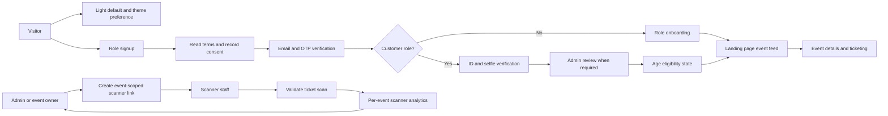
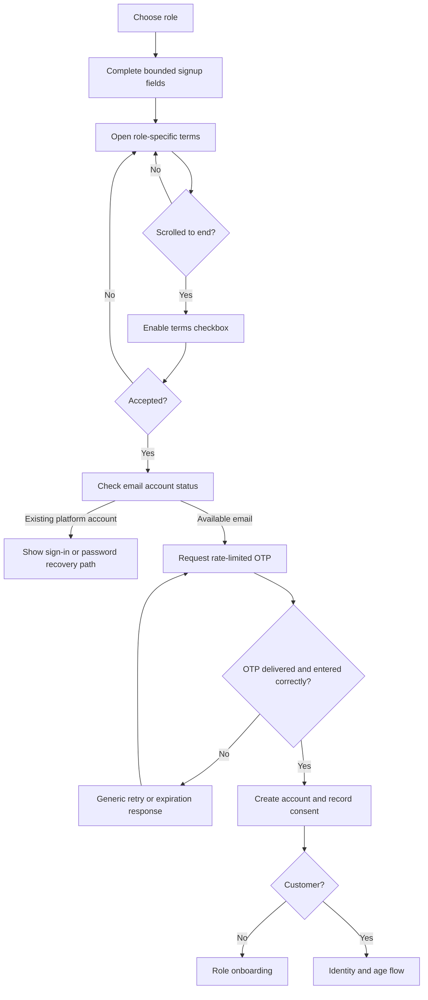
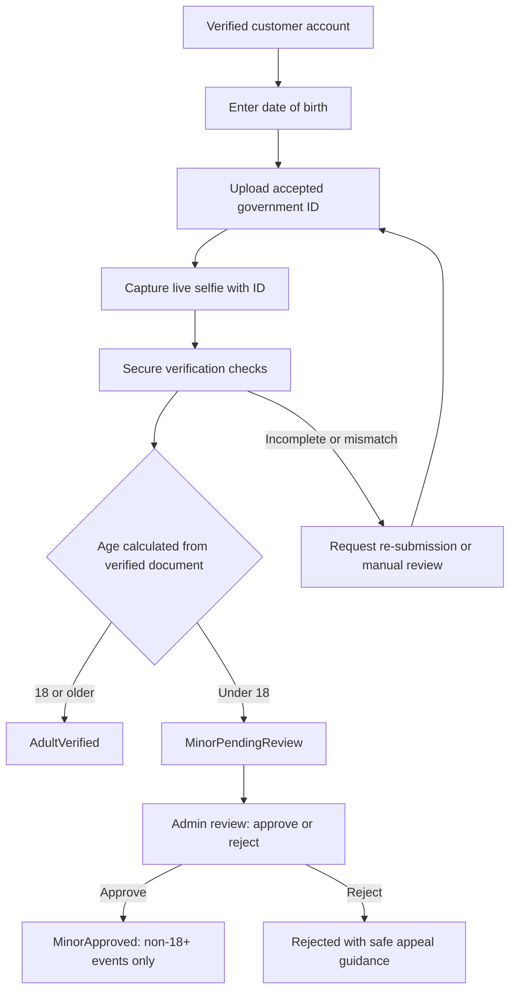
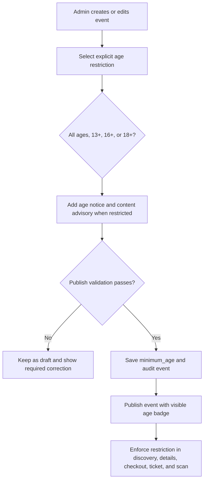
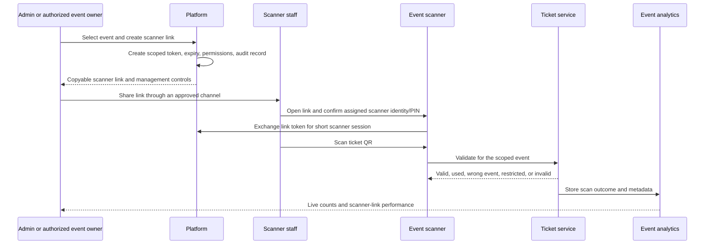

# Systems Revision Flow

## Scope and decisions

This document translates the revision notes into implementation-ready system
flows. It does not change the current application.

### Rules that apply everywhere

- Every page starts in light mode. A user can switch to dark mode at any time;
  the preference is retained for future visits.
- Signup fields enforce server-side length limits as well as UI limits. Display
  names, usernames, and contact fields use role-appropriate limits, reject
  control characters, and are normalized before saving.
- Terms acceptance is a recorded consent event: role, terms version, timestamp,
  IP-derived security metadata, and the accepted document hash/version.
- All protected actions enforce authorization on the server. Hiding a UI action
  is never considered access control.

### Account and verification states

| State | Meaning | What the person can do |
| --- | --- | --- |
| `Draft` | Signup has not been submitted. | Complete fields and read terms. |
| `EmailPending` | OTP requested and not yet verified. | Enter or request a rate-limited OTP. |
| `PendingVerification` | Email verified; customer identity/age review is needed. | Browse permitted content only. |
| `AdultVerified` | Customer's age is confirmed as 18 or older. | Access events subject to each event's rules. |
| `MinorPendingReview` | Customer is under 18 and submitted guardian/identity evidence when required. | Browse age-appropriate events only. |
| `MinorApproved` | An admin has approved the minor account for age-appropriate use. | Use non-18+ events only. |
| `Rejected` | Identity, age, or evidence review failed. | Cannot buy tickets or access restricted events. |
| `Suspended` | Account has been temporarily or permanently restricted. | No protected actions. |

`MinorApproved` never grants access to an 18+ event. An account must be
`AdultVerified` before it can view details, buy tickets, receive a ticket, or
enter an 18+ event.

## System map

## 1. Theme flow

1. A page loads with `light` as the default when no saved preference exists.
2. The page reads the saved preference before rendering to prevent a visible
   light-to-dark flash.
3. The user changes the theme from the shared navigation/profile control.
4. The browser immediately applies the chosen theme and saves it locally.
5. Every page uses the same shared theme script and CSS tokens.

Failure behavior: if local storage is unavailable, render light mode and allow
the session-only toggle to continue working.

## 2. Signup, terms, and OTP flow

### Signup details

1. The visitor selects a role. Each role presents the terms that apply to that
   role, plus the general platform terms.
2. Before accepting, the visitor must open the terms panel and scroll to the
   final section. Only then does the acceptance checkbox become enabled.
3. The frontend validates required fields and length limits. The API repeats
   the validation, normalizes the email, and checks for an existing platform
   account before creating or sending an OTP.
4. If the email is already registered, do not send a signup OTP. Offer sign-in
   and password recovery without disclosing more account information than
   necessary.
5. For an available email, generate a one-time code with a short expiry,
   request/device rate limits, attempt limits, and a single-use record.
6. After a correct OTP and terms acceptance, create the account and record the
   consent audit data. The OTP cannot be reused.
7. Customer accounts continue into identity and age verification. Other roles
   continue to their normal onboarding.

### Email-existence requirement

Mail providers do not offer a dependable, privacy-safe API that confirms a
mailbox exists before sending. The implementation should therefore treat a
successful OTP verification as proof that the person controls the mailbox.
For an undeliverable address, return a neutral delivery error after the mail
provider rejects it or the code expires. Do not expose SMTP diagnostic details
or use address-enumeration services.

## 3. Terms and minors flow

The terms page must include a distinct minors section, written for the
Philippines legal context and reviewed by a qualified local lawyer before
release. It should state:

- the platform's minimum account age and whether guardian consent is required;
- that 18+ events are unavailable to all minors, even after approval;
- the required identity, selfie, and guardian evidence for a minor when
  applicable;
- data collection, retention, access control, and deletion policy for ID and
  facial images;
- the age-rating responsibilities of event organizers and the platform's right
  to refuse or remove a restricted listing.

## 4. Customer identity and age flow

### Customer rules

1. The customer provides date of birth, a permitted ID image, and a live selfie
   while holding the ID. The interface explains why each item is collected.
2. The backend stores encrypted evidence outside public file paths, records
   access, and never returns raw documents to normal client sessions.
3. Automated checks detect basic document/selfie problems. A failure is not a
   final accusation; it routes to re-submission or manual review.
4. The verified document determines the age state, not a manually entered age.
5. For people under 18, an admin reviews the submission and records a decision,
   reason code, reviewer, and timestamp. Approval grants only age-appropriate
   access.
6. Event discovery, event-detail APIs, checkout, ticket issuance, and scanner
   admission all enforce `minimum_age` using the customer's verified state.
7. At the venue, the ticket scanner rechecks the event age rule. A ticket is not
   an override of the event's age restriction.

## 5. Logged-in landing page flow

1. A visitor opens the landing page.
2. If not signed in, show the public landing content and sign-in/signup calls to
   action.
3. If signed in, request the event feed using the authenticated session.
4. The API filters events by publication status, event dates, moderation state,
   and the customer's verified age eligibility.
5. The landing page shows current/upcoming eligible events, tickets/bookmarks,
   and the role-relevant shortcuts. Restricted events are excluded rather than
   shown as purchasable.
6. If verification is pending, show a clear verification status card and only
   age-appropriate public events.

## 6. Admin event-creation age restriction flow

Age restriction is chosen as part of every event created or edited by an
administrator. The event cannot be published until an age setting is selected;
`All ages` is an explicit choice, not an implicit default.

### Admin event form and publish rules

1. The admin event form includes a required `Age restriction` field with these
   values: `All ages (0+)`, `13+`, `16+`, and `18+`. The API accepts only these
   supported values.
2. When a restricted value is chosen, the form requires an audience advisory
   explaining the reason, such as explicit content, alcohol service, venue
   policy, or local legal requirement. The public event page displays both the
   age badge and advisory before a customer starts checkout.
3. The API saves the selected value as `events.minimum_age`, plus the advisory,
   creator, last editor, and change timestamp. Every create, update, publish,
   or age-rule change is written to the security audit trail.
4. An event can only become `Published`/`Upcoming` when its restriction and
   required advisory are valid. A draft remains invisible to customers.
5. The public events API and landing page return the age badge for eligible
   customers and omit events the signed-in customer may not access. The event
   detail and checkout APIs repeat the same server-side eligibility check.
6. If the restriction is raised after tickets have been sold, the platform
   immediately blocks new incompatible purchases, identifies affected tickets,
   alerts the admin, and requires an explicit resolution workflow (for example,
   retain an equivalent age-appropriate event, issue a refund, or cancel).
   It must not silently leave an ineligible customer with unusable admission.
7. Lowering an age limit still creates an audit record. Changing between
   restricted values after publication requires an admin confirmation dialog
   summarizing the customer and ticket impact.

### Customer and entry enforcement

1. A customer who does not meet the event's `minimum_age` cannot view its full
   details, start checkout, receive a new ticket, transfer into that ticket, or
   enter using the scanner.
2. `18+` requires an `AdultVerified` customer state. A manually approved minor
   can participate only in events where their verified age meets the selected
   restriction.
3. Existing ticket checks enforce the current event restriction again at ticket
   download, transfer acceptance, and entry. The scanner returns a clear
   `AGE RESTRICTION` result without exposing identity-document data to staff.

## 7. Event scanner-link flow

The scanner is delegated event work, not a shared administrator session. Each
link has only the minimum permission required to scan tickets for one event.

### Create and manage a scanner link

1. An administrator or authorized organizer opens an event's ticketing tools.
2. They select `Create scanner link` and set a label (for example, `Gate A`),
   start/end time, expiration, optional scan limit, and assigned staff member.
3. The backend creates a cryptographically random token. Store only a hash of
   the token and associate it with one event, one permission (`scan`), and the
   link configuration.
4. The UI displays the full link once for copying/sharing. It is never exposed
   again through the API after creation.
5. The creator can see link status, revoke it immediately, rotate it, and view
   the scoped analytics. Revoked or expired links cannot create a new session.
6. Scanner staff open the link, see the event name/date and their limited
   permission, then complete a lightweight staff identity check such as a
   one-time PIN or assigned-account login.
7. The platform exchanges the link for a short-lived scanner session. Scanner
   sessions cannot access admin settings, other events, customer records, or
   ticket downloads.

### Scan validation

1. The scanner sends the signed QR value and its scanner-session credential.
2. The API derives the event from the scanner credential; the browser must not
   choose the event ID.
3. In one atomic database operation, validate ticket existence, payment,
   refund status, event match, ticket unit, prior use, and age restriction.
4. If valid, mark that exact ticket unit as used and return the success screen.
   A second simultaneous scan is rejected as already used.
5. For every result, record the outcome, scanner-link ID, scanner session ID,
   timestamp, event ID, and a privacy-minimized device identifier. Avoid storing
   raw QR values and exact location unless there is a documented need and
   lawful notice/consent.
6. Push the result to the authorized event dashboard so attendance totals update
   live without giving staff access to admin accounts.

### Scanner-link analytics per event

Each event dashboard shows only its own data:

- link label, creation time, creator, assigned staff, status, expiry, and last
  activity;
- link opens, scanner-session starts, unique active devices, and failed access
  attempts;
- valid scans, duplicate scans, invalid QR scans, wrong-event scans, refund
  locks, and age-restriction denials;
- scan activity by time and by scanner link/gate;
- total tickets sold, checked in, remaining, and check-in rate;
- exports restricted to administrators/authorized organizers, with an audit
  event for each export.

## 8. Required persistence and audit records

| Record | Purpose |
| --- | --- |
| `user_preferences` | Theme preference and update time. |
| `terms_acceptances` | Role, terms version/hash, accepted time, and security metadata. |
| `otp_challenges` | Hashed/one-time challenge, expiry, attempt count, delivery state, and rate-limit keys. |
| `identity_verifications` | Encrypted evidence references, submitted time, check results, state, reviewer, and decision reason. |
| `events.minimum_age` | Required explicit event age rule: `0`, `13`, `16`, or `18`. |
| `events.age_advisory` | Required explanation for a restricted event and public age notice. |
| `event_age_rule_audits` | Event, prior/new value, editor, reason, time, and affected-ticket resolution reference. |
| `scanner_links` | Event scope, hashed link token, label, owner, permissions, validity window, and revocation state. |
| `scanner_sessions` | Link, staff identity, expiry, device summary, and last activity. |
| `ticket_scan_events` | Result, ticket-unit reference, event, link/session, timestamp, and minimal security metadata. |
| `security_audit_events` | Creation, revocation, review, export, rejected access, and sensitive-evidence access events. |

## 9. Authorization matrix

| Action | Customer | Scanner staff | Organizer | Admin |
| --- | --- | --- | --- | --- |
| Change theme | Own preference | Own preference | Own preference | Own preference |
| View eligible events | Yes | Public/assigned event only | Own events and public events | Yes |
| Buy 18+ ticket | Adult verified only | No | No | Operational support only |
| View identity evidence | Own status only | No | No by default | Assigned reviewer only |
| Review minor verification | No | No | No | Yes |
| Set an event age restriction | No | No | No | Yes |
| Create/revoke scanner link | No | No | Authorized own-event role | Yes |
| Scan tickets | No | Assigned event only | Optional assigned scanner session only | Optional assigned scanner session only |
| View scanner analytics | Own tickets only | No | Assigned event only | Yes |

## 10. Implementation order

1. Establish shared light-default theme behavior across every page.
2. Add signup field limits, terms-scroll consent, versioned consent recording,
   duplicate-account checks, and hardened OTP challenges.
3. Add the minors terms section, required admin event-age selection, age
   advisory, and event `minimum_age` rule.
4. Build secure customer identity/age verification and the admin review queue.
5. Enforce verified-age eligibility in event feed, event details, checkout,
   ticket delivery, and ticket scanning.
6. Make the signed-in landing page load the eligible event feed.
7. Add scanner-link records, scoped session exchange, scanner UI, and atomic
   event-scoped scan validation.
8. Add live and historical per-event scanner analytics, audit logs, and tests.

## 11. Acceptance checks before release

- A new visitor always sees light mode first and can switch themes everywhere.
- Over-limit signup data is rejected by both the UI and API.
- The terms checkbox cannot be checked until the user has reached the end of
  the relevant terms, and an acceptance record is created.
- A duplicate platform email cannot receive a signup OTP; expired, reused, and
  rate-limited OTPs fail safely.
- A minor cannot access, buy, download, transfer, or enter an 18+ event in any
  account state.
- An admin cannot publish an event without explicitly choosing its age
  restriction; every restricted event displays its age badge and advisory.
- Raising an event's age restriction after sales begins blocks incompatible new
  sales and requires a recorded resolution for affected ticket holders.
- Sensitive ID/selfie assets are not publicly reachable and every reviewer
  action is auditable.
- A scanner link cannot scan tickets for a different event, cannot access admin
  pages, and stops working immediately after revocation/expiry.
- Two simultaneous scans of the same ticket unit result in exactly one success.
- Scanner analytics isolate events and links correctly and do not expose raw QR
  values or unnecessary personal data.
